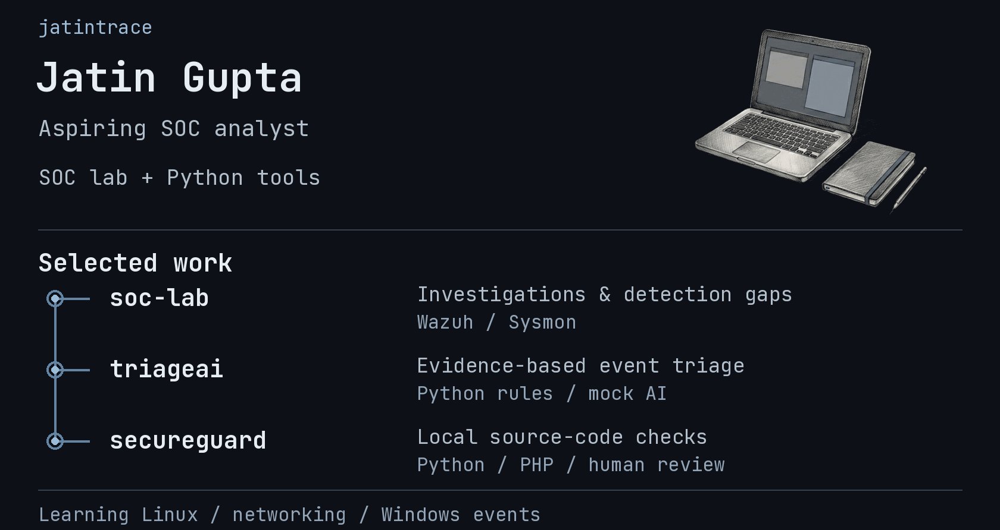

<picture>
  <source media="(prefers-reduced-motion: reduce) and (max-width: 600px)" srcset="assets/profile-mobile.png">
  <source media="(prefers-reduced-motion: reduce)" srcset="assets/profile.png">
  <source media="(max-width: 600px)" srcset="assets/profile-mobile.gif">
  
</picture>

[soc-lab](https://github.com/jatintrace/soc-lab) ·
[triageai](https://github.com/jatintrace/triageai) ·
[secureguard](https://github.com/jatintrace/secureguard)

Currently learning Linux, networking, and Windows security events.

Also: [ProofSentinel](https://github.com/jatintrace/proofsentinel) · [SOC-IQ](https://github.com/jatintrace/SOC-IQ) · [Portfolio](https://github.com/jatintrace/Portfolio)

These are learning projects. Each repository documents its scope and limitations.
